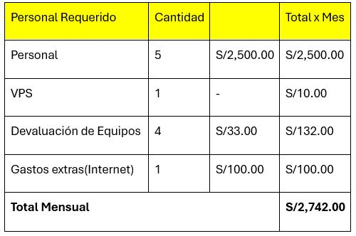
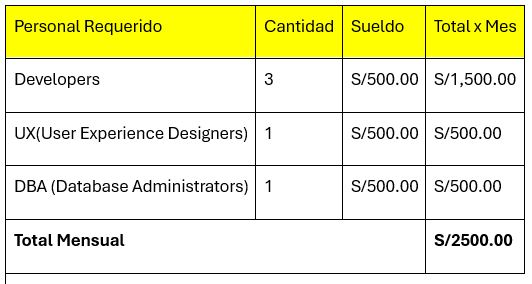

**UNIVERSIDAD PRIVADA DE TACNA**  
**FACULTAD DE INGENIERIA**  
**Escuela Profesional de Ingeniería de Sistemas**  

**Proyecto: *Proyecto Prevalencia de Enfermedades en el Campus***  

Curso: *Inteligencia de Negocios*  
Docente: Patrick Cuadros Quiroga  

**Integrantes:**  
***Meza Noalcca Jean Marco (2021071087)***  
***Luna Juárez Juan Brendon (2020068762)***  
***Elvis Mamani Valdivia (2020068763)***  
***Cristian Quispe Levano (2018000590)***  
***Angel Hernandez Cruz (2021000000)***  

**Tacna – Perú**  
**2024**

---

## Sistema de Evaluación de la Incidencia de Enfermedades en el Entorno Estudiantil

### Informe de Factibilidad

**Versión: *1.0***

| CONTROL DE VERSIONES  |     |     |     |     |
|:---------------------:|:---:|:---:|:---:|:---:|
| Versión              | Hecha por | Revisada por | Aprobada por | Fecha | Motivo |
| 1.0                  | MPV    | ELV          | ARV        | 10/10/2020 | Versión Original |

---

# Índice General

1. [Descripción del Proyecto](#descripcion-del-proyecto)
   - [1.1 Nombre del Proyecto](#nombre-del-proyecto)
   - [1.2 Duración del Proyecto](#duracion-del-proyecto)
   - [1.3 Descripción](#descripcion)
   - [1.4 Objetivos](#objetivos)
2. [Riesgos](#riesgos)
3. [Análisis de la Situación Actual](#analisis-de-la-situacion-actual)
   - [3.1 Planteamiento del Problema](#planteamiento-del-problema)
   - [3.2 Consideraciones de Hardware y Software](#consideraciones-de-hardware-y-software)
4. [Estudio de Factibilidad](#estudio-de-factibilidad)
   - [4.1 Factibilidad Técnica](#factibilidad-tecnica)
   - [4.2 Factibilidad Económica](#factibilidad-economica)
   - [4.3 Factibilidad Operativa](#factibilidad-operativa)
   - [4.4 Factibilidad Legal](#factibilidad-legal)
   - [4.5 Factibilidad Social](#factibilidad-social)
   - [4.6 Factibilidad Ambiental](#factibilidad-ambiental)
5. [Análisis Financiero](#analisis-financiero)
6. [Conclusiones](#conclusiones)

---

## Informe de Factibilidad

### 1. Descripción del Proyecto

#### 1.1 Nombre del Proyecto
**Proyecto Prevalencia de Enfermedades en el Campus**

#### 1.2 Duración del Proyecto
La duración del proyecto está planificada para 6 meses.

#### 1.3 Descripción
Este proyecto tiene como objetivo investigar cómo las enfermedades respiratorias han afectado a la salud y el bienestar general de los estudiantes universitarios en la Universidad Privada de Tacna. En el contexto universitario, donde los estudiantes enfrentan un entorno académico y social intensivo, es crucial entender cómo la prevalencia de estas enfermedades puede impactar su calidad de vida y rendimiento académico. 

El estudio analizará la relación entre la incidencia de enfermedades respiratorias y diversos factores, como la densidad en espacios comunes, los cambios estacionales, y la efectividad de las políticas de salud existentes. La importancia radica en proporcionar datos basados en evidencia para desarrollar estrategias de prevención y mejorar la salud pública en el campus.

#### 1.4 Objetivos

**Objetivo General**  
Evaluar la prevalencia de enfermedades entre los estudiantes universitarios de la Universidad Privada de Tacna y su impacto en la salud y el bienestar general, con el fin de formular recomendaciones para mejorar las políticas de salud y prevención en el campus.

**Objetivos Específicos**  
- Determinar la prevalencia de enfermedades respiratorias entre los estudiantes y su relación con factores como la densidad en espacios comunes y los cambios estacionales.
- Analizar el efecto de la densidad en áreas comunes y las prácticas de prevención en la reducción de la incidencia de enfermedades respiratorias.
- Comparar la incidencia de enfermedades respiratorias entre estudiantes de diferentes facultades y modalidades de estudio (presencial, online, híbrida).
- Desarrollar recomendaciones para la universidad sobre estrategias de prevención y políticas de salud basadas en los hallazgos del análisis.

---

### 2. Riesgos
- **Baja tasa de participación**: Es posible que no todos los estudiantes participen en el estudio, lo que puede afectar la representatividad de los resultados.  
  **Mitigación**: Promover el estudio a través de campañas de comunicación y ofrecer incentivos para aumentar la participación.

- **Recopilación inexacta de datos**: La calidad de los datos puede verse afectada por errores en la recolección o la autoevaluación de los participantes.  
  **Mitigación**: Utilizar métodos de recolección validados y realizar pruebas preliminares para asegurar la precisión y confiabilidad de los datos.

- **Factores externos que afectan la salud mental**: Eventos externos o cambios en el entorno pueden influir en los resultados del estudio.  
  **Mitigación**: Controlar y registrar estos factores en el análisis para ajustar los resultados en consecuencia.

- **Problemas éticos y de privacidad**: Asegurar la confidencialidad y el consentimiento informado de los participantes es crucial.  
  **Mitigación**: Implementar protocolos rigurosos para proteger la privacidad de los participantes y cumplir con las normas éticas.

- **Limitaciones de recursos**: El financiamiento o los recursos disponibles podrían ser insuficientes para llevar a cabo el proyecto de manera óptima.  
  **Mitigación**: Buscar financiamiento adicional, colaboraciones con otras instituciones o ajustes en el alcance del proyecto para adaptarse a los recursos disponibles.

---

### 3. Análisis de la Situación Actual

#### 3.1 Planteamiento del Problema
La Universidad Privada de Tacna (UPT) enfrenta un creciente interés en mejorar la salud mental y el bienestar de sus estudiantes debido a las altas tasas de estrés, ansiedad y depresión. Se han implementado diversos programas de apoyo psicológico y bienestar, pero aún no se ha evaluado exhaustivamente el impacto de la actividad física en la salud mental de los estudiantes.

#### 3.2 Consideraciones de Hardware y Software

**Hardware:**
- **Computadoras o Laptops**: 
  - Procesador: Intel Core i5 o superior.
  - Memoria RAM: Mínimo de 8 GB.
  - Almacenamiento: SSD de al menos 256 GB.
  - Pantalla: Resolución Full HD (1920x1080 píxeles) recomendada.

**Software:**
- **Power BI Desktop**: 
  - Aplicación gratuita que permite el diseño, modelado y análisis de informes de datos. Compatible con Windows 10 o superior.

---

### 4. Estudio de Factibilidad
El estudio de factibilidad tiene como objetivo determinar si el análisis de la prevalencia de enfermedades comunes entre estudiantes es viable en términos de recursos técnicos, económicos y organizativos.

#### 4.1 Factibilidad Técnica
- **Hardware**:
  - Equipos de computación adecuados en el campus.
  - Servidores con capacidad suficiente para manejar grandes volúmenes de datos.

- **Software**:
  - Aplicaciones como SPSS o Power BI.
  - Infraestructura de red sólida para acceder a bases de datos y sistemas de análisis.

**Conclusión Técnica**: La tecnología actual en el campus es adecuada para realizar el análisis de la prevalencia de enfermedades.

#### 4.2 Factibilidad Económica

**Costos del Proyecto:**
- **Personal**: $4,000.00.
- **Equipos y Software**: $2,000 - $5,000.
- **Materiales y Otros Recursos**: $1,000 - $2,000.

**Beneficios Esperados:**
- **Mejora en la Salud Estudiantil**: Identificación de tendencias que permitirá implementar intervenciones preventivas.
- **Datos para Políticas**: Apoyará la toma de decisiones para mejorar las políticas de salud en el campus.
- **Reconocimiento y Financiamiento**: Un estudio exitoso puede atraer financiamiento adicional.

**Conclusión Económica**: La inversión inicial está justificada por los beneficios esperados. El costo total del proyecto se estima entre **$13,000** y **$22,000**.

      
### 4.2.1. Costos Generales

En la factibilidad económica se considera el siguiente plan a ser analizado:

Consultando el portal web **Indeed**, se estima que el sueldo promedio de un profesional en el área de sistemas es de **S/ 2,800** por mes en Perú.

- **PAGO INICIAL**: S/ 1,941.82 (Primer mes)
- **PAGO MENSUAL**: S/ 1,941.82
- **VALOR DE SALVAMENTO**: S/ 792.00
- **TIEMPO ESTIMADO**: 6 meses
- **TASA DE INTERÉS**: 7.8%

---

### 4.2.2. Costos Operativos durante el Desarrollo

De igual manera, según lo recopilado del portal **Indeed**, calculamos el sueldo de los programadores y diseñadores, multiplicado por los 6 meses que está proyectado el desarrollo de nuestro trabajo.

### 4.2.3. Costos del Ambiente

Los costos relacionados con el entorno de un centro de desarrollo de software pequeño pueden fluctuar debido a diversos factores, incluyendo el tamaño del local, su ubicación geográfica, los requisitos de infraestructura y las necesidades particulares del equipo de desarrollo. A continuación, se presentan algunos de los gastos típicos asociados con el ambiente de trabajo en este tipo de centro.

---

### 4.2.4. Costos de Personal

Según el portal Indeed, el sueldo de un programador en Perú en este 2024 es de **S/.9.00 por hora** aproximadamente.  
A continuación se presenta el cuadro de costos de personal:

---

### 4.2.5. Costos Totales del Desarrollo del Sistema

Este cuadro de costos totales nos proporciona una visión integral y detallada de los costos iniciales, costos operativos y de personal que se asignaron para este proyecto del desarrollo del sistema.

#### Cuadro de costos totales:

    4.3. Factibilidad Operativa
    
El proyecto en cuestión es un sistema de base de datos para el Policlínico de la Universidad Privada de Tacna, desarrollado en Power BI. Este sistema tiene como objetivo principal mejorar la gestión de la información clínica y administrativa del policlínico, facilitando el acceso a datos relevantes, generando informes detallados y apoyando en la toma de decisiones.

    4.4. Factibilidad Legal

      El proyecto es un sistema de base de datos para el Policlínico de la Universidad Privada de Tacna, desarrollado en Power BI, con el objetivo de mejorar la gestión de la información clínica y administrativa.
Evaluación Legal:
Cumplimiento de Normativas: Asegúrate de que el sistema cumple con las leyes locales y nacionales relacionadas con la protección de datos personales, como la Ley de Protección de Datos Personales en Perú.
Regulaciones de Salud: Verifica que el sistema cumple con las regulaciones específicas del sector salud para la gestión y almacenamiento de datos clínicos.
Licencias de Software: Confirma que el uso de Power BI y otros componentes del sistema cumplan con las licencias y acuerdos de uso

    4.5. Factibilidad Social 

       El proyecto del sistema de base de datos para el Policlínico de la Universidad Privada de Tacna tiene como objetivo mejorar la eficiencia en la gestión de la información y apoyar en la toma de decisiones.
Evaluación Social:
Clima Político: Asegúrate de que no existan nuevas regulaciones o cambios políticos que puedan afectar el uso de tecnologías de datos en el sector salud.
Código de Conducta y Ética: Verifica que el sistema cumpla con los códigos de conducta y prácticas éticas, garantizando la confidencialidad y privacidad de los datos de los pacientes.
Aceptación del Usuario: Asegura la aceptación del sistema entre el personal médico y administrativo mediante una adecuada capacitación para facilitar la adaptación al nuevo sistema.

    4.6. Factibilidad Ambiental

 El sistema está diseñado para mejorar la gestión de la información y tiene un impacto ambiental mínimo.
Evaluación Ambiental:
Impacto Directo: El impacto ambiental del sistema es bajo, principalmente relacionado con el consumo de energía de los servidores y equipos. Se recomienda utilizar fuentes de energía renovable para minimizar este impacto.
Uso de Recursos: Asegúrate de que el hardware utilizado sea eficiente en términos de energía y que los equipos antiguos se dispongan de manera adecuada.
Residuos Electrónicos: Planifica la disposición y reciclaje adecuado de equipos electrónicos obsoletos para reducir residuos y minimizar el impacto ambiental.

\pagebreak

5. **Análisis Financiero**

    El plan financiero se ocupa del análisis de ingresos y gastos asociados a cada proyecto, desde el punto de vista del instante temporal en que se producen. Su misión fundamental es detectar situaciones financieramente inadecuadas.
    Se tiene que estimar financieramente el resultado del proyecto.

    5.1. Justificación de la Inversión

        5.1.1. Beneficios del Proyecto

            El beneficio se calcula como el margen económico menos los costes de oportunidad, que son los márgenes que hubieran podido obtenerse de haber dedicado el capital y el esfuerzo a otras actividades.
            El beneficio, obtenido lícitamente, no es sólo una recompensa a la inversión, al esfuerzo y al riesgo asumidos por el empresario, sino que también es un factor esencial para que las empresas sigan en el  mercado e incorporen nuevas inversiones al tejido industrial y social de las naciones.
            Describir beneficios tangibles e intangibles*
            Beneficios tangibles: son de fácil cuantificación, generalmente están relacionados con la reducción de recursos o talento humano.
            Beneficios intangibles: no son fácilmente cuantificables y están relacionados con elementos o mejora en otros procesos de la organización.
>
            Ejemplo de beneficios:

            - Mejoras en la eficiencia del área bajo estudio.
            - Reducción de personal.
            - Reducción de futuras inversiones y costos.
            - Disponibilidad del recurso humano.
            - Mejoras en planeación, control y uso de recursos.
            - Suministro oportuno de insumos para las operaciones.
            - Cumplimiento de requerimientos gubernamentales.
            - Toma acertada de decisiones.
            - Disponibilidad de información apropiada.
            - Aumento en la confiabilidad de la información.
            - Mejor servicio al cliente externo e interno
            - Logro de ventajas competitivas.
            - Valor agregado a un producto de la compañía.
        
        5.1.2. Criterios de Inversión
            Costos Totales del Proyecto:

            Calculo de Flujo de Caja Neto durante el tiempo del Proyecto:

            5.1.2.1. Relación Beneficio/Costo (B/C)
                El Beneficio al Ser 0.02 no aporta ningun Beneficio a la Empresa sin Embargo Ayudara a prevenir futuras crisis de Problemas Fisicos o  y Psycologicos

            5.1.2.2. Valor Actual Neto (VAN)
                Gasto del Proyecto llevado a la Actualidad

            5.1.2.3 Tasa Interna de Retorno (TIR)*
                No existe TIR

\pagebreak

6. **Conclusiones**

Explicar los resultados del análisis de factibilidad que nos indican si el proyecto es viable y factible.
